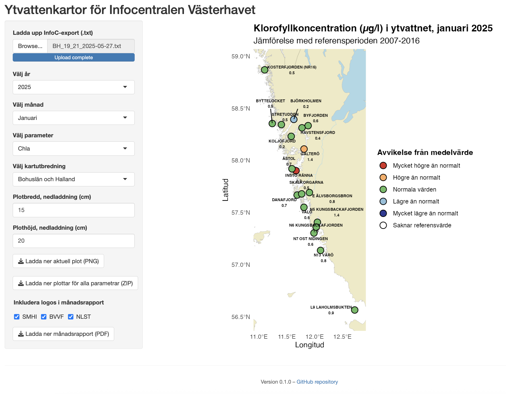

# Surface water maps for the Västerhavet Info Centre

This repository contains a [Shiny web application](https://nodc-sweden.shinyapps.io/ytvattenkartor/) that provides interactive mapping and visualization of surface water anomalies in the Västerhavet region, based on data exported for the Västerhavet Info Centre. The app allows users to upload data, select parameters, and generate customized maps based on historical statistics.

## ✨ Features

- Upload `.txt` files from a InfoC export from **SHARKtoolbox**
- Dynamic selection of:
  - Reference dataset
  - Year and month
  - Water quality parameters (e.g., Temperature, Salinity, Oxygen, etc.)
  - Geographic extent (Bohuslän, Halland, Bohuslän + Halland or dynamic based on available coordinates)
  - Plot size and aesthetics
- Calculates DIN from NO₂, NO₃, and NH₄
- Compares measurements to historical statistics (e.g., 2007-2016)
- Visualize historical statistics
- Uses values from specific depths:
  - **Surface values (0 m)** are used for all parameters except for **oxygen concentration**
  - **Bottom values** are used for **oxygen concentration** to capture deep-water conditions
- Categorizes anomalies (e.g., "Högre än normalt", "Lägre än normalt") and extremes (optionally)
- Downloads:
  - Current plot as PNG
  - All parameter plots for the current month as a ZIP archive
  - Monthly reports as a PDF

### Screenshot



## 📦 Installation

Clone this repository and install required R packages:

```r
install.packages(c("shiny", "tidyverse", "sf", "R.matlab", "ggrepel", "png", "tiff", "jpeg", "grid", "gridExtra", "ggpubr", "plotly"))
```

## 🚀 Running the App

From the R console or RStudio:

```r
shiny::runApp()
```

Or click **Run App** in RStudio.

## 📁 File Structure

```
.
├── R/
│   ├── helper.R             # Contains helper functions like create_plot(), convert_dmm_to_dd() etc.
│   └── load_data.R          # Loads station reference statistics from file, defines parameter metadata, anomaly categories, colors, and month names
├── assets/                  # Contains logos and images used by the app
├── data/                    # Contains data, such as map layers and reference data
├── scripts/                 # Misc scripts not directly used by app, but used for pre-processing data (e.g. updating reference datasets)
│   └── update_stats.R       # Script to update station reference statistics using `SHARK4R`
├── app.R                    # Main Shiny app file
└── README.md
```

## 📄 Data Requirements

- **Uploaded file**: Export from SHARKtoolbox, for InfoC in `.txt` format (tab-separated), encoded in ISO-8859-1 (latin1).
- Must include columns like `Year`, `Month (calc)`, `Lat`, `Lon`, `Depth`, `Station`, and selected parameters (e.g., `Temp CTD (prio CTD)`).

## 🔄 Updating Reference Data

The app uses pre-calculated reference datasets in `data/reference_data/` to compare uploaded measurements with historical statistics. These datasets are downloaded from [SHARK](https://shark.smhi.se/) using the `scripts/update_stats.R` script.

**To update:**

1. Run in R:  
   `source("scripts/update_stats.R")`
2. This downloads SHARK data, cleans and processes it, and saves:  
   - `data/reference_data/reference_data.rds`  
   - `data/reference_data/txt/<year_range>.txt`
3. Commit the updated `data/reference_data/reference_data.rds` file:  
   `git add data/reference_data/reference_data.rds && git commit -m "Update reference data" && git push`

**Notes:**  

- Adjust `from_year` and `to_year` in the script if needed. 
- `scripts/update_stats.R` requires `SHARK4R`. See https://github.com/sharksmhi/SHARK4R for installation instructions.
- The reference data can be visualized using `scripts/plot_stats.R`
- The app does not fetch SHARK data automatically—updates must be committed before deployment to be selectable in the app.

## 📤 Exports

- **PNG**: Download the currently displayed plot.
- **ZIP**: Download all parameter plots for the selected year and month.
- **PDF**: Download all parameter plots for the selected year and month in a PDF, including a logo page.

## 🚢 Deployment

This repository uses **GitHub Actions** to automatically deploy the latest version of the app to [shinyapps.io](https://https://www.shinyapps.io/) or its test environment.  
The deployment is configured in the [`.github/workflows/shinyapps.yaml`](.github/workflows/shinyapps.yaml) file.

### 🔁 Workflow Overview

The deployment target depends on how the workflow is triggered:

- **Pull request to `main`** → Deploys to the **test app**: [`ytvattenkartor-test`](https://nodc-sweden.shinyapps.io/ytvattenkartor-test/)  
  This allows testing the app before merging.
- **Push or merge into `main`** → Deploys to the **production app**: [`ytvattenkartor`](https://nodc-sweden.shinyapps.io/ytvattenkartor/)

**Workflow steps:**

1. GitHub Actions detects the event (push or pull request).
2. The app name (`APP_NAME`) is set dynamically:
   - Pull request → `ytvattenkartor-test`
   - Push to main → `ytvattenkartor`
3. The R environment is set up with the version specified in the workflow.
4. Dependencies are installed using the `renv.lock` file.
5. The app is deployed to shinyapps.io using the `rsconnect` package, with `APP_NAME` passed to `rsconnect::deployApp()`.

This setup ensures that all pull requests are tested in a staging environment before affecting the live application.

### 🔒 Secrets

Deployment credentials are stored securely in GitHub repository secrets:

- `SHINYAPPS_USERNAME`
- `SHINYAPPS_TOKEN`
- `SHINYAPPS_SECRET`

## 📄 License

This project is licensed under the MIT License.
